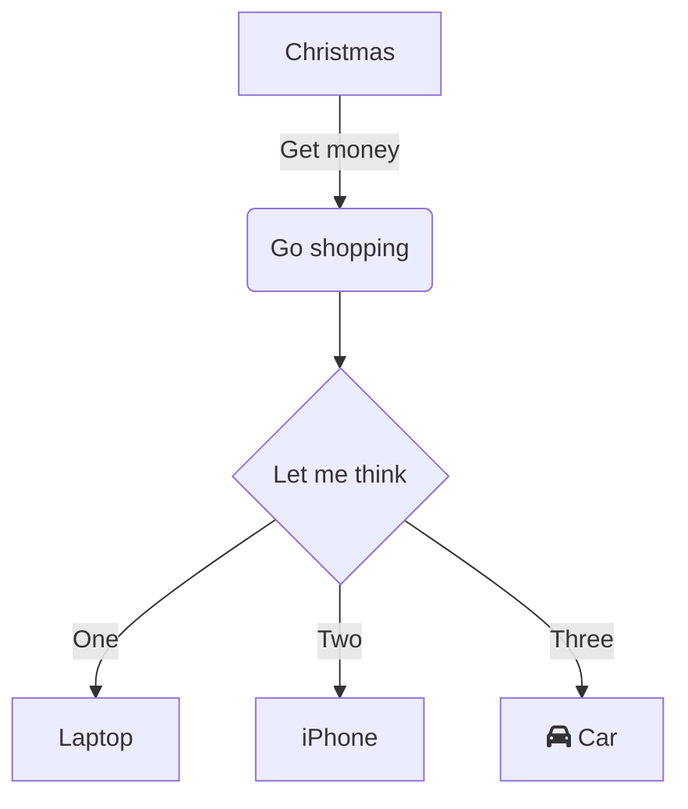

# Mermaid

Generate diagrams, charts, graphs or flows from markdown-like text via javascript. 

### Installation

```yaml
markdown_extensions:
  - pymdownx.superfences:
      custom_fences:
        - name: mermaid
          class: mermaid
          format: !!python/name:pymdownx.superfences.fence_div_format
          
extra_css:
  - https://unpkg.com/mermaid@8.4.6/dist/mermaid.css
  
extra_javascript:
  - https://unpkg.com/mermaid@8.4.6/dist/mermaid.min.js
```

# Samples




